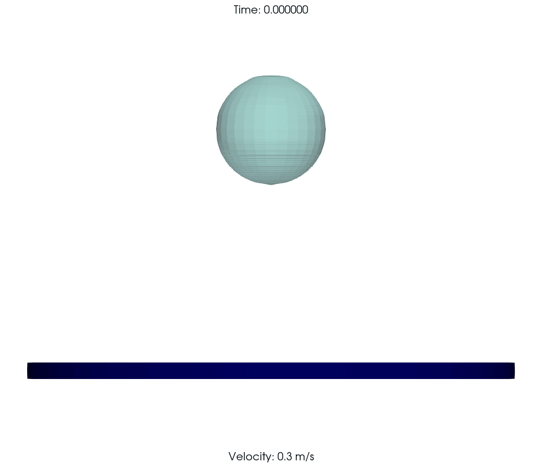
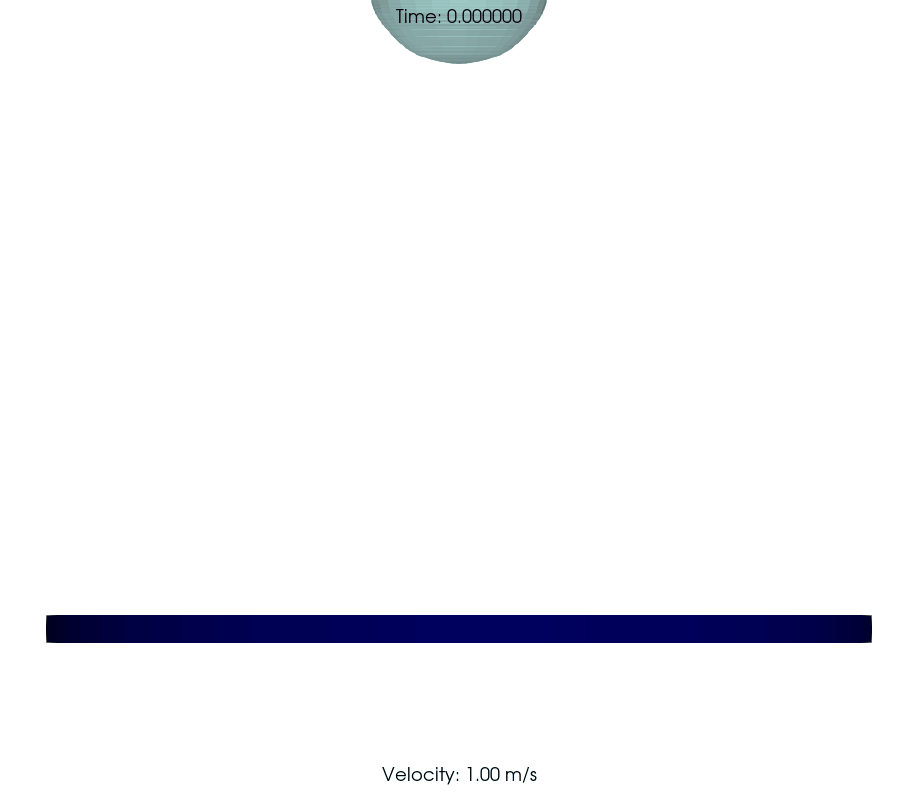

# Impact Dynamics of a non-newtonian drop on superhydrophobic surface

<table>
  <tr>
    <th>2000 PPM PAM at 0.30 m/s</th>
    <th>2000 PPM PAM at 1.00 m/s</th>
  </tr>
  <tr>
    <td></td>
    <td></td>
  </tr>
</table>
